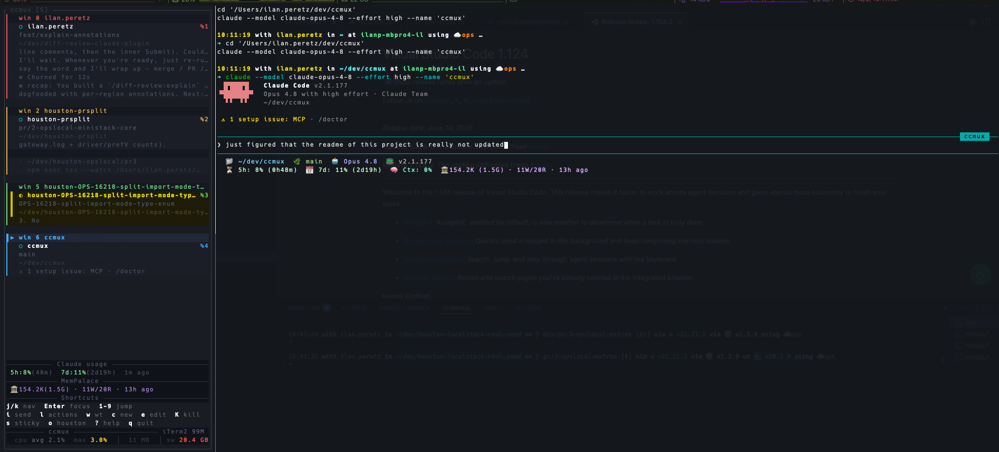
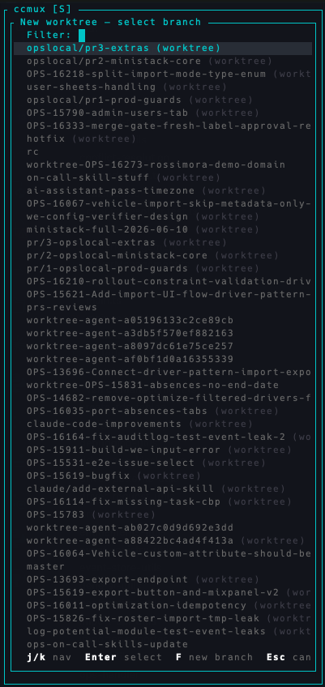
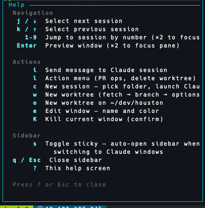

# ccmux

A tmux **sidebar** for managing many Claude Code sessions at once.

ccmux lives in a thin pane down the side of your tmux window. It shows every
window running Claude Code (or `ocli` / `ops-cli`), tells you which ones are
working, idle, or waiting for your input, and lets you jump between them, spin
up git worktrees, answer prompts, and manage windows — all without leaving the
keyboard.

ccmux is a heavily extended fork of
[claude-tmux](https://github.com/nielsgroen/claude-tmux) by Niels Groeneveld.

```
┌ ccmux [S] ──────────────┐
│ win 0 ilan.peretz       │
│   ○ ilan.peretz      %1 │   ●  working   — actively processing
│   feat/explain-…        │   ✻  thinking  — extended reasoning
│ win 2 houston-prsplit   │   ◐  waiting   — needs your input
│   ○ houston-prsplit  %2 │   ○  idle      — ready for input
│   pr/2-opslocal-…       │   ⚠  alert     — fired a notification
│ ▶ win 6 ccmux           │
│   ○ ccmux            %4 │   Footer: Claude usage · MemPalace
│   main                  │           stats · ccmux CPU/RSS
└─────────────────────────┘
```

## Screenshots



<p>

&nbsp;&nbsp;

</p>

## How it works

ccmux scans your tmux panes for ones running `claude` (and `ocli` / `ops-cli`),
groups them by window, and renders one entry per window in the sidebar. For the
selected window it shows a short **live preview** of the pane, the **git
branch**, and a **status icon** derived from the pane's on-screen content.

It does not poll an API or wrap Claude Code — it reads tmux panes directly, so
it works with whatever you already have running.

## Install

### Build from source

```bash
git clone https://github.com/ilanp-ob/ccmux.git
cd ccmux
cargo install --path .          # installs `ccmux` to ~/.cargo/bin
```

### Wire it into tmux

The quickest setup is the bundled TPM plugin. Add to `~/.tmux.conf`:

```tmux
set -g @plugin 'ilanp-ob/ccmux'
set -g @ccmux-toggle-key C-c     # prefix + C-c toggles the sidebar
```

Press `prefix + I` to install the plugin, then run the one-time setup to install
the auto-open hooks and `prefix + Ctrl+1..9` session-jump bindings:

```bash
ccmux setup
```

That's it. `prefix + C-c` now toggles the sidebar in the current window.

See [`docs/tmux-setup.md`](docs/tmux-setup.md) for the optional status-bar
integration that renders the status icon next to each window name.

## Keybindings

These mirror the in-app help — press `?` inside the sidebar to see them.

### Navigation

| Key | Action |
|-----|--------|
| `j` / `↓` | Select next session |
| `k` / `↑` | Select previous session |
| `1`–`9` | Jump to session by number (press again to focus its pane) |
| `Enter` | Preview window (press again to focus the Claude pane) |

### Actions

| Key | Action |
|-----|--------|
| `i` | Send a message to the selected Claude session (or reply to a job) |
| `l` | Action menu — answer a prompt, PR ops, delete worktree |
| `c` | New session — pick a folder and launch Claude |
| `w` | New worktree — fetch → pick branch → name folder → launch options |
| `o` | New worktree on a fixed repo (`worktree.houston_path`, default `~/dev/houston`) |
| `h` | Browse Claude history for this repo (preview / resume past sessions) |
| `g` | Git status popup — full `git status` + `diff` for the selected repo |
| `p` | PR status popup — `gh pr view` + checks for the selected branch |
| `f` | Folder browser — drill-down file tree with preview; opens files in `$CCMUX_EDITOR` (default `nano`) |
| `F` | neo-tree popup — Neovim file explorer (isolated config; requires `nvim`) |
| `e` | Edit the current window — name and color |
| `K` | Kill the current window (with confirmation) |

### Sidebar

| Key | Action |
|-----|--------|
| `s` | Toggle **sticky** — auto-open the sidebar when you switch to a Claude window |
| `q` / `Esc` | Close the sidebar |
| `?` | Show / hide the help overlay |

The title bar shows `ccmux [S]` when sticky mode is on.

## Status detection

ccmux classifies each session by reading its pane content. No status is reported
by Claude itself — it's all inferred from what's on screen.

| Icon | Status | Detected from |
|------|--------|---------------|
| `●` | **Working** | input field + `ctrl+c to interrupt` hint |
| `✻` | **Thinking** | spinner ornament + `Thinking…` / extended-thinking |
| `◐` | **Waiting** | `[y/n]` prompts, tool-approval footers, numbered choices, or a trailing conversational question |
| `○` | **Idle** | input field present, no interrupt hint |
| `?` | **Unknown** | none of the above |

When the answer is ambiguous, ccmux uses whether the pane content *changed*
since the last check to decide between "still working" and "settled".

## Features

- **Live session overview** — every Claude window in one pane, with branch,
  path, status icon, and a short preview of the selected one. Extra (non-Claude)
  panes in a window are listed underneath.
- **Worktree workflow** — `w` runs a guided flow: fetch origin → pick a branch
  (local + remote, sorted by recency, with existing worktrees annotated) → edit
  the folder name → choose model, effort, color, and whether to launch Claude /
  open VSCode. Built on `git2` and `git worktree`.
- **Smart action menu** — `l` parses the pane for the current question (y/n,
  numbered lists, inline "choose A, B, or C", agent action items) and lets you
  answer with one keystroke. Also offers PR create/view/merge/close via `gh` and
  worktree deletion.
- **Background job tracking** — surfaces daemon agents (e.g. `/schedule` runs)
  from `~/.claude/jobs/`, shows their status, and lets you reply to or resume
  them.
- **Notifications** — a background worker fires a macOS notification (and tmux
  bell) when a session transitions from working/thinking to idle or
  waiting-for-input, and flags the window with `⚠`.
- **History browser** — `h` lists every Claude session for the selected window's
  repo (current worktree first, then all worktrees), with type-to-filter. `Enter`
  opens a formatted transcript in a popup; `Ctrl+r` resumes the session in a new
  window (falling back to the repo root if the original worktree is gone).
- **Git status** — the selected window's repo shows a live summary line
  (branch · ↑↓ ahead/behind · ● staged · + unstaged · ? untracked) and a
  bounded list of changed files. `g` opens the full `git status` + `diff` in a
  popup. Computed in the background and throttled, so it never blocks the UI.
- **PR status** — `p` opens a popup with the selected branch's pull-request
  overview (`gh pr view`) and CI checks (`gh pr checks`): state, reviewers,
  mergeable, pass/fail. On-demand only — gh runs when you press the key, so
  there's no background API traffic.
- **Folder browser** — `f` opens a drill-down file browser for the selected window's
  project: navigate folders (`../` to ascend), with a tree preview (`eza --tree`) for
  folders and a syntax-highlighted preview (`bat`) for files. Enter opens the file in an
  in-terminal editor — `$CCMUX_EDITOR` if set, otherwise `nano` (never vim). Built on
  `fzf`/`fd`/`eza`/`bat`.
- **neo-tree popup** — `F` opens Neovim's neo-tree file explorer in a popup, rooted at the
  project, for richer collapsible-tree navigation (files open in Neovim). Includes
  Telescope search: **`Ctrl-p`** fuzzy file-name search, **`Ctrl-g`** content search
  (ripgrep), **`Ctrl-e`** toggle the tree back from a file. Uses a fully self-contained
  Neovim config bootstrapped into ccmux's cache dir, so it never touches your own
  `~/.config/nvim`. Requires `nvim` (`brew install neovim`); `Ctrl-g` needs `ripgrep`.
- **Window management** — rename and recolor windows (`e`), create (`c`) or kill
  (`K`) them. Colors persist in a tmux variable and can drive the status bar.
- **At-a-glance footer** — Claude usage (5h / 7d %, time to reset) and MemPalace
  stats read from the statusline cache, plus ccmux's own CPU/RSS and the host
  terminal app's memory.
- **Multi-server** — manage additional named tmux servers via `servers.extra`.

## Configuration

ccmux reads `~/.config/ccmux/config.toml`, creating it with defaults on first
run. The defaults:

```toml
[sidebar]
width = 50            # sidebar pane width in columns
position = "left"
refresh_ms = 5000     # how often to reload the pane list
status_ms = 5000      # how often to refresh status icons
sticky = true         # auto-open on switching to a Claude window

[claude]
alias = "claude"
default_model = "claude-sonnet-4-6"
default_effort = "high"

[detection]
commands = ["claude", "ocli", "ops-cli"]   # pane commands treated as sessions

[notifications]
enabled = true
macos = true
tmux_bell = true
repeat_secs = 0

[worktree]
base_dir = "~/dev"             # where new worktrees are created
houston_path = "~/dev/houston"
defaults = { base_branch = "origin/master" }

[servers]
extra = []                     # additional `tmux -L <name>` servers to manage
```

Available models: `claude-opus-4-8`, `claude-opus-4-7`, `claude-opus-4-6`,
`claude-sonnet-4-6`, `claude-haiku-4-5`. Efforts: `low`, `medium`, `high`,
`max`, `auto`.

## CLI

ccmux is one binary with subcommands; most are invoked by tmux for you.

| Command | Purpose |
|---------|---------|
| `ccmux toggle` | Open/close the sidebar in the current window (bound to your toggle key) |
| `ccmux setup` | Install auto-open hooks and `prefix + Ctrl+1..9` jump bindings |
| `ccmux close` | Close every ccmux sidebar on this tmux server |
| `ccmux status --window <id>` | Print the status icon for the tmux status bar |
| `ccmux focus <N>` | Jump to session #N (auto-opens the sidebar) |
| `ccmux sidebar` | Run the sidebar TUI (called internally by `toggle`) |
| `ccmux notify-worker` | Background status-change notification daemon (spawned internally) |
| `ccmux auto-open --window <id>` | Auto-open hook target (called by tmux) |
| `ccmux pty-attach <session>` | Attach to a running daemon agent via its PTY socket |

Add `--server <name>` to target a non-default tmux server.

## Architecture

```
src/
├── main.rs          # CLI (clap), command dispatch, sidebar pane lifecycle, tmux hook install
├── config.rs        # config.toml load/save; color/model/effort tables
├── detection.rs     # status detection from pane content (well-tested)
├── git.rs           # git worktree management via git2 + `git worktree`
├── jobs.rs          # background daemon-agent tracking from ~/.claude/jobs/
├── notify.rs        # notification worker (macOS / terminal-notifier / osascript)
├── session.rs       # status, pane, and window-group data structures
├── sidebar/
│   ├── mod.rs       # app state machine, refresh ticks, global info
│   ├── input.rs     # keyboard/mouse handling, readline editing, choice parsing
│   ├── mode.rs      # UI modes and multi-step flow definitions
│   ├── render.rs    # ratatui rendering (list, overlays, footer, help)
│   └── hostmem.rs   # ccmux + host terminal memory/CPU sampling
└── tmux/
    ├── mod.rs       # tmux command wrappers
    ├── detect.rs    # pane → window-group detection
    ├── state.rs     # pane state structures
    └── windows.rs   # window listing helpers
```

## Dependencies

[ratatui](https://ratatui.rs/) · [crossterm](https://github.com/crossterm-rs/crossterm)
· [git2](https://github.com/rust-lang/git2-rs)
· [clap](https://github.com/clap-rs/clap)
· [serde](https://serde.rs/) / serde_json / [toml](https://github.com/toml-rs/toml)
· [anyhow](https://github.com/dtolnay/anyhow) · [dirs](https://github.com/dirs-dev/dirs-rs)
· [unicode-width](https://github.com/unicode-rs/unicode-width)

## License

AGPL-3.0-only. Based on [claude-tmux](https://github.com/nielsgroen/claude-tmux)
by Niels Groeneveld.
